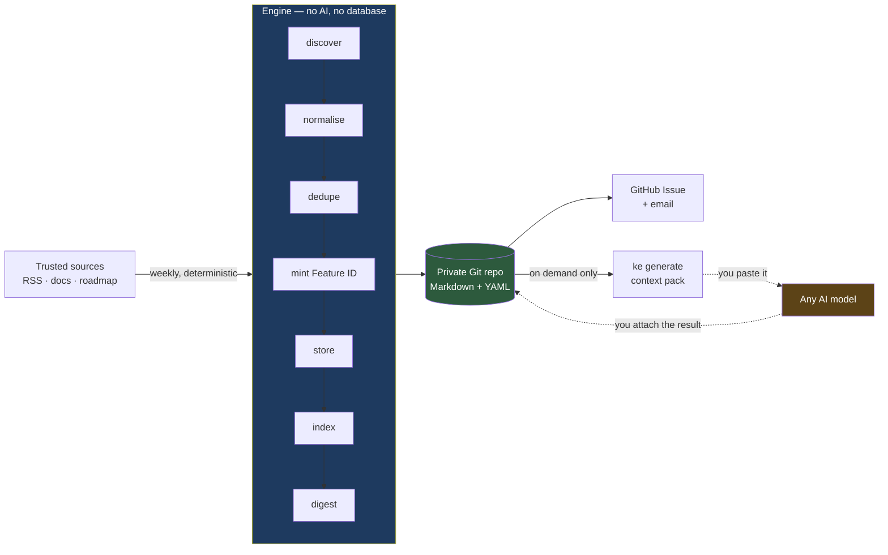

# Knowledge Engine

**A model-independent Knowledge Operating System.**

Knowledge Engine discovers, structures and maintains technical knowledge as plain
Markdown in a Git repository you own — then hands it to whatever AI model you
like, on demand.

The first Domain Pack is **Microsoft Fabric**. Power BI, SQL, Python, Azure,
Databricks, Snowflake, AWS and Personal Knowledge follow.

[](https://github.com/sathyarajeshpk/knowledge_engine/actions/workflows/ci.yml)

---

## Why this exists

If you work in a fast-moving platform ecosystem, you face four problems:

1. **Updates arrive faster than you can read them**, so you find out about
   breaking changes from a broken pipeline.
2. **What you learn evaporates.** Bookmarks rot; notes apps become write-only.
3. **Your best explanations are trapped in someone's chat history**, in a format
   you do not control.
4. **Learning has no state.** Nothing knows what you have learned, what is
   in progress, or what you should study next.

Knowledge Engine fixes all four by keeping one idea straight:

> **Separate the knowledge from the intelligence.**

| Layer | What it is | Who owns it | Lifespan |
|---|---|---|---|
| Knowledge | Markdown + YAML in Git | You | Decades |
| Structure | IDs, indexes, relationships, learning state | Deterministic code | Decades |
| Intelligence | Whatever model you feel like today | Rented, replaceable | Months |

**The test of whether this works:** if every AI vendor disappeared tomorrow, the
repository would still be a complete, structured, useful body of knowledge — and
the engine would keep maintaining it.

Full reasoning in [`docs/VISION.md`](docs/VISION.md).

---

## How it works

Every Sunday, a GitHub Actions job discovers new knowledge from trusted sources,
deduplicates it, classifies it, stores it as a knowledge object, rebuilds the
indexes, writes a weekly digest and notifies you.

**That pipeline never calls an AI model.** It is fully deterministic — same
inputs, same outputs, zero cost, no vendor.

Generation — tutorials, LinkedIn posts, interview questions, coding examples,
architecture explanations, quizzes, infographic prompts — happens **on demand**.
`ke generate` produces a self-contained Markdown *context pack* that you paste
into Claude, ChatGPT, Gemini, Kimi, or anything that comes next. No API key, no
adapter, no lock-in. ([ADR-0004](docs/adr/0004-no-ai-in-the-scheduled-pipeline.md))



The dotted lines are the only places AI touches the system — and a human is
standing on both of them.

---

## Getting started

Requires **Python 3.11+**.

```bash
git clone https://github.com/sathyarajeshpk/knowledge_engine.git
cd knowledge_engine

python -m pip install -e ".[dev]"

python -m pytest engine/tests -q     # 91 tests, ~0.6s
python -m ke validate                # check every Domain Pack
```

Expected output:

```
ok: 1 pack(s), 0 knowledge object(s), no findings
```

Zero objects is correct — M0 builds the foundation; M1 adds discovery.

### `ke validate`

The guardrail. It enforces the rules in [`CLAUDE.md`](CLAUDE.md): no duplicate
Feature IDs, nothing silently deleted, paths that match their IDs, no full
third-party article text. It runs in CI on every push.

```
usage: ke validate [--pack NAME] [--repo-root PATH] [--strict]
```

Every finding carries a stable code (`ID003`, `OWN001`, `REG002`) documented in
[`docs/SCHEMA.md`](docs/SCHEMA.md) §9.

---

## Repository structure

```
knowledge_engine/
├── engine/                   ← ALL CODE. Knows nothing about any subject.
│   ├── ke/
│   │   ├── models.py         What a knowledge object IS + field ownership
│   │   ├── pack.py           Finding and loading Domain Packs
│   │   ├── validate.py       25 checks against the schema contract
│   │   └── __main__.py       CLI: python -m ke validate
│   └── tests/                91 tests
│
├── domain-packs/             ← ALL DATA. Contains no code.
│   └── microsoft-fabric/
│       ├── pack.yml          Config: prefix, categories, limits, sources
│       ├── knowledge/        Knowledge objects, by YYYY/MM
│       ├── indexes/          Generated, rebuilt every run
│       ├── digests/          Weekly summaries
│       └── state/            Engine bookkeeping (ID registry, run log)
│
├── docs/
│   ├── SCHEMA.md             The data contract
│   ├── VISION.md             Why this exists, and where it goes
│   ├── ROADMAP.md            M0–M9 and the Domain Pack plan
│   ├── JOURNAL.md            Development journal per milestone
│   ├── adr/                  14 Architecture Decision Records
│   ├── playbook/             File-by-file developer guides
│   └── learning/             Concept guides for each milestone
│
└── .github/workflows/ci.yml  Tests + validation on every push
```

**The one structural rule:** `engine/` is code, `domain-packs/` is data, and
neither knows the other's specifics. Verifiable:

```bash
grep -ri "microsoft-fabric" engine/     # returns nothing
```

This is what lets a new Domain Pack be a folder rather than a code change, and
what will let `engine/` become its own repository later.
([ADR-0011](docs/adr/0011-monorepo-engineered-to-split.md))

---

## How Domain Packs work

A **Domain Pack** is one knowledge repository for one subject. It is pure data.

### A knowledge object

Every object is a **directory** whose path never changes for its entire lifetime:

```
knowledge/2026/04/MSF-2026-04-001-direct-lake-ga/
├── feature.md      canonical knowledge article (short summary + link)
├── metadata.yaml   structured metadata
├── artifacts/      generated tutorials, posts, quizzes, code examples
├── images/         infographics, diagrams
└── references/     supporting notes
```

### Feature IDs

```
MSF-2026-04-001
│   │    │  └── sequence within that month
│   │    └───── month — from the publication date, or discovery if unknown
│   └────────── year
└────────────── pack prefix
```

**Permanent. Never reused. Never renumbered** — including for replaced objects.
Sorting IDs gives chronological order.
([ADR-0005](docs/adr/0005-date-based-feature-ids.md))

### Field ownership — the important part

`metadata.yaml` mixes facts from the source with **your own work**. A job rewrites
those files weekly. So every field belongs to exactly one class:

| Class | Engine behaviour | Examples |
|---|---|---|
| **Engine-owned** | Rewritten freely | `title`, `source_url`, `content_hash`, `reading_time` |
| **Engine-proposed** | Written only if absent or unlocked | `tier`, `difficulty`, `tags`, `category` |
| **User-owned** | **Never written by the engine** | `learning_status`, `notes`, `prerequisites`, relationships |

Disagree with the engine's judgement? Change the value and lock it:

```yaml
difficulty: advanced
overrides: [difficulty]
```

This is not a convention. `with_engine_fields()` raises `PermissionError`, and
three import-time assertions prove the classes never overlap.
([ADR-0008](docs/adr/0008-field-ownership-model.md))

### The three classification axes

Independent on purpose. A licensing change is urgent but has nothing to teach; a
community deep-dive is not urgent but is the best possible tutorial source.

| Field | Question | Values |
|---|---|---|
| `tier` | How urgent in real work? | `1` act now · `2` learn soon · `3` awareness |
| `learning_priority` | Worth building content around? | `high` · `medium` · `low` |
| `source_authority` | Where did it come from? | official / community / third-party |

### Adding a pack

```bash
mkdir -p domain-packs/<name>/{knowledge,indexes,digests,state}
# write pack.yml with a permanent id_prefix
echo '{"counters": {}, "paths": {}}' > domain-packs/<name>/state/id-registry.json
python -m ke validate
```

No engine change. If one was needed, that is an engine bug.

---

## Development workflow

Work proceeds **one milestone at a time**, and the next does not start until the
current one is reviewed, merged and approved.

Every milestone delivers, without being asked:

- A PR review summary written as a Senior Software Architect
- A Developer Playbook — `docs/playbook/M<n>_*.md`
- A Learning Guide — `docs/learning/M<n>_*.md`
- An interactive code walkthrough, one file at a time
- Journal, roadmap, changelog and ADR updates

| # | Milestone | Status |
|---|---|---|
| M0 | Foundation, schema, guardrails | **done** |
| M1 | Discovery — source adapters | next |
| M2 | Identity, dedupe, storage | planned |
| M3 | Classification and learning metadata | planned |
| M4 | Relationships and knowledge graph | planned |
| M5 | Revisions, updates, staleness | planned |
| M6 | Weekly automation and notifications | planned |
| M7 | Retrieval and on-demand generation | planned |
| M8 | Second pack — proves the abstraction | planned |
| M9 | Hardening, migration, split-readiness | planned |

Full detail in [`docs/ROADMAP.md`](docs/ROADMAP.md).

---

## Contributing

Read [`CONTRIBUTING.md`](CONTRIBUTING.md) for coding standards, commit
conventions, testing requirements and the review process.

The short version — six rules are enforced by mechanisms, not by review:

| Rule | What enforces it |
|---|---|
| Knowledge is never deleted | `ObjectStatus` has no `deleted` member |
| The engine never writes user-owned fields | `PermissionError` |
| Ownership classes never overlap | Import-time assertions |
| Feature IDs are unique and permanent | `ke validate` |
| No AI in the scheduled pipeline | CI workflow scan |
| No full third-party article text | `ke validate` |

If a change needs to break one of these, it needs an ADR — not a workaround.

**New here?** Start with [`docs/playbook/M0_FOUNDATION.md`](docs/playbook/M0_FOUNDATION.md)
for the codebase, or [`docs/learning/M0_LEARNING_GUIDE.md`](docs/learning/M0_LEARNING_GUIDE.md)
if the Python concepts are new.

---

## Design principles

**Rules must be mechanisms, not documentation.** If you find yourself writing "we
should remember to…", you have found a missing mechanism.

**Determinism is a feature.** Testable, reproducible, debuggable, free and
vendor-independent — five benefits from one constraint.

**Data over code.** Categories, limits and rules live in `pack.yml`. Tuning
behaviour is a text edit, not a release.

**Nothing is lost, only marked.** Corrections append revisions. Superseded
objects are `replaced`. Stale artifacts are `stale`. Near-duplicates are flagged
for review, never dropped.

**Build the guardrails before the thing they guard.** M0 shipped no pipeline —
only the schema, the ID rules, the ownership model, the validator and CI.

---

## Cost

| Item | Cost |
|---|---|
| GitHub private repository | ₹0 |
| GitHub Actions (~22 of 2,000 free minutes/month) | ₹0 |
| AI API calls | ₹0 — the pipeline makes none |
| Database, servers, hosting | ₹0 — there are none |
| **Total** | **₹0/month** |

Target was ₹20/month. Zero cost is a design constraint, not thrift: a system with
no running cost never needs a business case and never gets switched off.

---

## Documentation

| Document | What it covers |
|---|---|
| [`CLAUDE.md`](CLAUDE.md) | The non-negotiable project rules |
| [`docs/VISION.md`](docs/VISION.md) | Why this exists, goals, philosophy, long view |
| [`docs/ROADMAP.md`](docs/ROADMAP.md) | M0–M9, Domain Packs, non-goals |
| [`docs/SCHEMA.md`](docs/SCHEMA.md) | The data contract `ke validate` enforces |
| [`docs/adr/`](docs/adr/) | 14 Architecture Decision Records |
| [`docs/JOURNAL.md`](docs/JOURNAL.md) | Development journal per milestone |
| [`docs/playbook/`](docs/playbook/) | File-by-file developer guides |
| [`docs/learning/`](docs/learning/) | Concept guides per milestone |
| [`CHANGELOG.md`](CHANGELOG.md) | Version history |
| [`CONTRIBUTING.md`](CONTRIBUTING.md) | Standards, conventions, review process |
