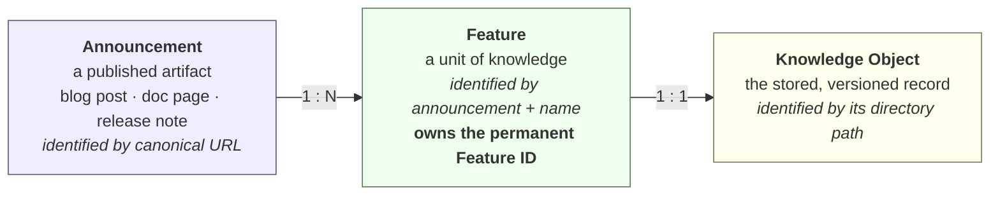

# Design — Announcement, Feature, Knowledge Object

**Status:** Revision 2. The three-level model and Recommendation C are
**approved**; Identity Confidence is added here for review before any code that
affects permanent Feature IDs is written.
**Decides:** how identity is modelled, and when it is trusted enough to mint
**Date:** 2026-07-31

## Revision history

| Rev | Change |
|---|---|
| 1 | Three-level model, component evaluation, options A–D |
| 2 | **Identity Confidence** (§6); Power BI gated rather than excluded (§8.3); the Recommendation-B threshold left open and evidence-driven (§7.2) |

---

## 1. The question

M1's validation found that the engine assumes **one announcement URL = one
feature**. Measured against production, that is false: one Microsoft announcement
routinely covers several independent features, so several distinct updates
collapse into one identity — and in M2 that becomes one permanent Feature ID with
the rest silently absent.

The proposal to evaluate:

> Should the pipeline distinguish **Announcement → Feature → Knowledge Object**,
> and should identity be computed from announcement URL, feature title, category
> and normalised feature text, rather than announcement URL alone?

Short answer: **the three-level model is correct and should be adopted.** Of the
four proposed identity components, **two must be included and two must be
excluded** — and the reasons for exclusion are empirical, not aesthetic.

But the measurements also surfaced a constraint that changes the sequencing: the
obvious fix is not currently safe to apply yet (§5). The approved answer is to
anchor identity as it is today, refuse to merge silently, and gate minting on
**Identity Confidence** (§6) — so that no permanent Feature ID is created while
identity uncertainty exists.

---

## 2. What the data says

All figures measured against the live Fabric "What's New" source
(`tools/identity_experiment.py`, run on a GitHub Actions runner).

### 2.1 The cardinality is genuinely one-to-many

| | Count |
|---|---|
| Rows discovered | 315 |
| Distinct announcement URLs | 214 |
| URLs cited by more than one row | 65 |
| …where all rows are the **same** feature (correct de-duplication) | 49 |
| …where rows are **distinct** features (the defect) | 16 |
| Distinct features currently lost to merging | 28 |
| Items citing an announcement host rather than a doc page | **75%** |

The largest cluster is a monthly summary post cited by **18 rows covering 11
distinct features**:

```
…/Fabric-June-2026-Feature-Summary/…
    Fabric Git Integration – GitHub Enterprise Cloud with Data Residency
    New default AI functions (Generally Available)
    Data agents in Microsoft 365 Copilot (Generally Available)
    Eventstream streaming connectors for Apache Kafka and Azure Service Bus
    CI/CD Support for SQL analytics endpoint (Preview)
    Conditional activity retries in Data Factory pipelines (Preview)
    …
```

These are not variations of one thing. They are independent features that happen
to have been announced on the same day. **The three-level model is not a
refinement; it describes reality, and the current model does not.**

### 2.2 Scoring the candidate identity schemes

| Scheme | Features | Agreement | Merged groups | Distinct lost |
|---|---|---|---|---|
| **url only** (today) | 214 | **98%** | 16 | 28 |
| **url + title** | 242 | **35%** | 0 | 0 |
| **url + title + category** | **315** | 34% | 0 | 0 |
| **title only** | 241 | 35% | 0 | 0 |

*Agreement* = share of the secondary representation's identities that the primary
also produced. It is a stability proxy, explained and qualified in §5.

Three things fall out of this table immediately:

1. **Adding the title fixes merging completely** — 16 merged groups → 0.
2. **Adding the title collapses stability** — 98% → 35%.
3. **Adding the category destroys identity outright** — 315 identities from 315
   rows means *every row* becomes its own feature, so even the 49 genuine
   repeats stop de-duplicating.

---

## 3. The model

Adopt three distinct concepts. They are currently conflated into one.



| Concept | Is | Is not | Identified by |
|---|---|---|---|
| **Announcement** | a source artifact that *reports* features | knowledge | canonical URL |
| **Feature** | the unit of knowledge | a document | announcement + feature name |
| **Knowledge Object** | the stored record of a Feature | a source artifact | its permanent path |

**The rule that follows:** an announcement is a *citation*, not an identity. It
says where knowledge was reported, not what the knowledge is. Today the engine
treats the citation as the identity, which is why two features reported in one
post cannot be told apart.

### 3.1 A modelling defect this exposes

`RawItem.source_url` currently falls back to the *source definition's own URL*
when a link cannot be resolved. Measured: 7 items carry
`raw.githubusercontent.com/.../whats-new.md` as their "announcement" — which is
the document being read, not an announcement at all.

Under the new model these must be distinguishable. `announcement_url` should be a
separate, **explicitly nullable** field. "This feature has no announcement" is a
fact worth representing; substituting the source document silently invents one
and would corrupt any per-announcement reporting.

---

## 4. Evaluating the four proposed identity components

### 4.1 Announcement URL — **include, as scope**

Its value is *not* discrimination. Measured, `title only` yields 241 features and
`url + title` yields 242 — the URL separates exactly **one** additional case out
of 242.

Its value is **scoping**: it prevents two different announcements that happen to
use the same feature name from colliding. Rare today, but the failure is silent
and permanent, and the cost of keeping it is one hash input.

> Note it does **not** add stability. A composite of two components changes when
> *either* changes, so `url + title` is strictly *less* stable than either alone.
> This is why agreement does not improve when the URL is added to the title.

### 4.2 Feature title — **include, as the discriminator**

The evidence is unambiguous: within a shared announcement, distinct features
always have distinct titles (0 merged groups under `url + title`), and repeated
rows of the same feature always share a normalised title (the 49 true repeats
still collapse correctly).

`normalise_title` already absorbs marketing rewording and word order. Its known
limit — verb changes — is documented in ADR-0023 and pinned by a test.

**This is the component that carries all the risk.** See §5.

### 4.3 Category / section — **exclude. Rejected on evidence.**

This is the strongest empirical finding in the analysis, and it rejects one of
the four proposed components outright.

**It is many-to-many.** 67 of 242 features (**28%**) appear under more than one
section. Including category would mint a separate permanent Feature ID for each:

```
"New SQL analytics endpoint metadata sync option (preview)"  → 3 IDs
    Fabric Data Engineering
    Fabric Data Warehouse
    Features currently in preview
```

**It is time-varying.** Sections encode lifecycle state — "Features currently in
preview" and "Generally available features" are both section headings. When a
feature reaches GA it *moves between sections*, so its identity would change and
a second permanent ID would be minted. That directly contradicts **ADR-0009**
(one ID per concept; GA is recorded as a revision, not a new object).

**It destroys de-duplication.** `url + title + category` produced **315
identities from 315 rows** — one per row. Even the 49 genuine repeats stop
collapsing.

> Category is knowledge *about* a feature. It belongs in `tags` and `category`,
> where the user can override it. Anything a human may reasonably re-file must
> never be part of a permanent identifier.

### 4.4 Normalised feature text — **exclude. Structurally contradictory.**

Summary text changes whenever documentation is edited. Including it means every
wording change mints a new permanent Feature ID.

More fundamentally, it **collides with the revision mechanism**. `content_hash`
over title+summary is precisely how the engine detects *that a feature changed*
so it can append a revision (ADR-0020). If the same bytes also determined
identity, then "this feature changed" and "this is a different feature" would be
the same signal — and revisions could never be recorded at all.

This is already why content fingerprint sits at rank 4 in ADR-0023: it changes
whenever anything changes, which is exactly when identity must not.

### 4.5 Summary

| Component | Verdict | Reason |
|---|---|---|
| Announcement URL | **Include** — as scope | Prevents cross-announcement collisions; cheap |
| Feature title | **Include** — as discriminator | The only thing that separates features within an announcement |
| Category | **Exclude** | 28% multi-section; time-varying with lifecycle; shatters de-duplication |
| Normalised text | **Exclude** | Would destroy the revision mechanism |

---

## 5. The constraint that changes the sequencing

`url + title` scores **35% agreement** where `url only` scores 98%. That number
needs careful interpretation, and then it needs to be taken seriously.

### What the number actually measures

The two representations title rows by different rules **by construction**: the
HTML adapter takes the first linked text, the Markdown adapter takes the first
content cell. So the 35% is not "titles get reworded 65% of the time". It is:

> **If the way a title is obtained changes, ~65% of title-derived identities
> change with it.**

That is an upper bound on rewording risk, and it overstates week-to-week churn.
**But it is an exact measure of something else that matters more**, and this is
the part that must not be waved away:

> Under composite identity, **failing over from the primary to the secondary
> would churn roughly two-thirds of all Feature IDs.**

The fallback chain — the thing M1 built to protect against Learn becoming
unreachable — would become a mass duplicate-ID generator the first time it
fired, automatically, with no human present. Power BI is worse: **5% agreement**.

So the fix for the merging defect, applied today, would trade a known 28-feature
loss for an unbounded duplication event on a day nobody is watching. That is not
an improvement.

### The prerequisite

The 35% is caused by **inconsistent title extraction**, not by unstable sources.
That is a defect in our adapters, and it is fixable:

- Define one title-selection rule and apply it in every adapter (candidate: the
  first non-date content cell, falling back to the linked text — the rule that
  matches how the source visually presents a feature name).
- Add a CI assertion that cross-representation title agreement stays above a
  threshold, so it cannot silently regress.
- Re-measure with `tools/identity_experiment.py`.

**Composite identity becomes safe once agreement is high, and not before.** The
target is agreement in the same range as URL-only (≥90%); if it cannot be reached,
composite identity should not be adopted and Option C below becomes the answer.

---

## 6. Identity Confidence

Approved as an architectural concept; the rules below are the proposal.

The three-level model says *what* identity is. It does not say **how much we
trust a particular identity** — and that turns out to be the question that
actually gates minting. `identity_basis` already records what the identity rests
on, but a basis alone cannot distinguish "this URL identifies exactly this
feature" from "this URL identifies a post covering eleven features".

### 6.1 The distinction that makes this work

> **Identity is permanent and run-independent. Confidence is a per-run
> assessment of whether minting is safe yet.**

This resolves a tension from Revision 1. Run-scoped evidence — *how many distinct
features share this announcement in this run* — was rejected as an input to
**identity**, because an identity that changes when a row stops appearing is not
permanent (§8, "no run-time cardinality rules"). That rejection stands.

But the same evidence is entirely legitimate for **confidence**, because
confidence never becomes part of the ID. It decides *whether to mint now*.
Once minted, the identity is fixed forever regardless of what confidence does
afterwards.

So:

- Confidence **may** use run-scoped evidence. Identity **may not**.
- Confidence is recomputed every run. Identity is computed once, ever.
- A change in confidence never changes an existing Feature ID.

### 6.2 The evidence

All four signals are deterministic — derived from the item and the run, with no
model, no randomness, no wall clock.

| Signal | Question it answers |
|---|---|
| **Basis durability** | Is the identity anchored on a canonical URL / source identifier, or on a title hash / content fingerprint? |
| **Announcement exclusivity** | Within this run, how many *distinct normalised feature titles* share this announcement URL? |
| **Title substance** | Is there a usable normalised title at all? |
| **Anchor resolution** | Did we resolve a real announcement URL, or fall back to the source document? (§3.1) |

### 6.3 The rules

```
HIGH    durable basis  AND  the announcement resolves to exactly one
        distinct feature in this run
        → the URL identifies this feature. Mint automatically.

MEDIUM  durable basis  BUT  the announcement is shared by several distinct
        features                                    (the merging case)
        OR weak basis (title hash) with a substantive title
        → identifiable but ambiguous. Queue for review; never auto-mint.

LOW     content-fingerprint basis, or no usable title, or no resolvable anchor
        → nothing durable to rest on. Never auto-mint, under any setting.
```

Deliberately **not** a numeric score. A score invites a tunable threshold, and a
tunable threshold is a dial someone eventually turns to make a backlog go away.
Three named states with stated reasons cannot be quietly relaxed.

### 6.4 Measured against production

| Source | Items | High | Medium | Low |
|---|---|---|---|---|
| Fabric primary (HTML) | 336 | 264 (**78%**) | 72 (21%) | 0 |
| Fabric secondary (Markdown) | 315 | 251 (**79%**) | 64 (20%) | 0 |
| Power BI primary (HTML) | 25 | 14 (**56%**) | 11 (44%) | 0 |
| Power BI secondary (Markdown) | 19 | 14 (**73%**) | 5 (26%) | 0 |

Medium decomposes cleanly, which is the sign the rules are targeting the right
thing rather than just being cautious:

| Reason | Fabric | Power BI |
|---|---|---|
| Durable basis, announcement shared by several features | 57 | 0 |
| Weak basis (title hash), no resolvable URL | 7 | 5 |

**~79% of knowledge mints automatically; ~20% is queued for a human.** That is a
usable ratio — a gate that queued most of the pack would be a gate nobody uses.

**Low is currently empty, and that is reported honestly rather than presented as
a success.** No current source produces titleless rows. Low is a safety floor for
sources not yet onboarded — feeds without titles, malformed rows, future packs —
not a level that does work today.

### 6.5 What confidence does *not* fold in

`identity_confidence` answers one question: how much do we trust this
**identity**. It deliberately does not absorb two neighbouring facts, for the
same reason `date_precision` was separated from `date_confidence`: a field asked
two questions has to lie about one of them.

- **`date_confidence`** — whether the publication date is exact or inferred. It
  matters for minting because the Feature ID *contains the month*, but it is
  evidence about the date, not the identity.
- **`source_authority`** — official / community / third-party. A property of the
  source, not of this item's identity.

They are combined at the **mint gate**, which is a separate, explicit rule:

```
mint automatically  ⟺  identity_confidence is HIGH
                       AND source_authority is OFFICIAL
otherwise           →  review queue (never silently dropped)
LOW confidence      →  never minted automatically, regardless of authority
```

Keeping these separate means the gate can be tightened or loosened without
rewriting what any single field means.

### 6.6 The consequence that must be handled: review latency

An item queued as Medium may become High in a later run and mint then. If its ID
month came from *that* run's discovery date, review latency would silently shift
the Feature ID — an item found in July but approved in September would be filed
under September, permanently.

**Therefore:** a queued item must record its **first** discovery date, and
minting must use that, not the date approval happened. The ID reflects when the
knowledge appeared, never how long a human took to look at it.

This is a small detail with a permanent consequence, and it only becomes visible
once minting is gated — which is why it belongs in this proposal rather than
being discovered during M2.

---

## 7. Options

| | Merging fixed? | Stability | Failover safe? | Reversible? |
|---|---|---|---|---|
| **A.** Composite now | Yes | 35% | **No** | No — IDs are permanent |
| **B.** Unify titles, then composite | Yes | to be measured | Only above a threshold | No, but validated first |
| **C.** Keep URL identity, flag collisions | No — deferred | 98% | Yes | **Yes** |
| **D.** Host-class rule | ~80% | mixed | Partly | No |

**A — Adopt composite immediately.** Correct model, correct components, wrong
moment. Rejected on the failover evidence.

**B — Unify title extraction, verify, then adopt composite.** *Recommended.*
Fixes the model properly and pays down the defect that makes it unsafe. Costs one
extra step before M2.

**C — Keep URL-only identity; make merging visible instead of silent.** When one
identity resolves to more than one distinct normalised title, emit a review item
rather than merging. Nothing is lost silently, no wrong IDs are minted, and the
decision stays open. Today that surfaces 16 cases covering 28 features.
This is the **safe interim** and composes with B.

**D — Treat announcement hosts as non-identifying.** My earlier suggestion in the
M1 review. The measurements weakened it: 3 of 16 merging groups are
`learn.microsoft.com`, so it fixes only ~80% of the defect while still pushing
75% of the pack onto title-derived identity. It buys most of B's risk for less
than B's benefit. Withdrawn.

### 7.1 Decision

**C, with Identity Confidence. B deferred until the evidence justifies it.**

1. Adopt the three-level model as permanent architecture, and make
   `announcement_url` a separate nullable field.
2. Ship **C**: identity stays URL-anchored, and a collision — one identity
   resolving to several distinct normalised titles — becomes a review item
   instead of a silent merge.
3. Add **Identity Confidence** (§6) as the gate on minting.
4. Keep measuring cross-representation agreement on every source-check run.
5. Revisit **B** only when the accumulated evidence supports a threshold (§7.2).

No permanent Feature ID is created while identity uncertainty exists — which is
the property that makes every step above reversible.

### 7.2 The Recommendation-B threshold is deliberately not set

Revision 1 proposed ≥90%. **That number is withdrawn**: it was chosen for
plausibility, not derived from anything.

What exists today is a **single observation** — 98% for URL-only against 35% for
composite, measured once, on one day, on two sources, where the disagreement is
known to be dominated by a defect of ours (inconsistent title extraction) rather
than by source behaviour. That is enough to reject Option A. It is nowhere near
enough to calibrate a threshold that will gate permanent identifiers.

**What would justify a threshold:**

| Evidence needed | Why |
|---|---|
| Agreement measured across **many runs over time**, not one snapshot | Distinguishes real week-to-week churn from a one-off difference between two renderings |
| Agreement measured **after** title extraction is unified | The current 35% mostly measures our own inconsistency, so it is a bound on the wrong quantity |
| The **observed rate of genuine rewording** on the live page between runs | This is the quantity a threshold should actually be set against |
| Agreement on **more than two sources** | Two sources cannot show whether a threshold generalises |

`tools/identity_experiment.py` runs on every source-check, so the series
accumulates without further work. The threshold should be proposed from that
series, with the reasoning recorded — not asserted in advance and then defended.

Until then, **C plus Identity Confidence is the standing answer**, and it is a
stable place to stay: it loses no knowledge, mints no doubtful IDs, and queues
what it cannot decide.

---

## 8. Power BI

**Power BI knowledge is not excluded.** The mint gate handles it, and the gate is
strictly better than a source-level switch because it discriminates per item
rather than per source.

### 8.1 What the gate does to Power BI

Measured on both representations:

| | Items | High (mints) | Medium (queued) | Low |
|---|---|---|---|---|
| Power BI **primary** (HTML) | 25 | **14** (56%) | 11 (44%) | 0 |
| Power BI **secondary** (Markdown) | 19 | **14** (73%) | 5 (26%) | 0 |

Power BI carries a heavier review burden than Fabric — 44% of primary items queue
against Fabric's 21%. That is a source property (fewer resolvable links), not a
defect, and it is the honest cost of not minting on weak identities.

**The number that matters is that both representations yield the same 14.** The
fallback probe independently reports 14 identity keys present in both. So the
mint gate admits *exactly* the items that survive failover — the High-confidence
set and the cross-representation-agreement set are the same 14 items.

### 8.2 Power BI has no publication dates

Zero of 19 rows carry a date. Every Power BI Feature ID would take its month from
the *discovery* date with `date_confidence: inferred`, so an item announced in
March but first harvested in August is filed under August, permanently.

This is a source property, not a parser defect, and it is a separate axis from
identity — which is exactly why §6.5 keeps `date_confidence` out of
`identity_confidence`. It is recorded here so the mint gate's date clause can be
decided deliberately rather than inherited by accident (§11, Q2).

### 8.3 The Markdown fallback should now be re-enabled — pending confirmation

It was disabled last revision because failing over would mint ~5 duplicate
permanent Feature IDs out of 19. **Identity Confidence removes that reason, and
the measurement in §8.1 proves it rather than argues it**: both representations
produce the same 14 High-confidence items, and those are exactly the 14 whose
identities agree across representations. The 5 that diverge are precisely the
weak-basis items the gate now holds back.

So failing over to the Markdown secondary would mint **the same objects**, not
duplicates. The duplication risk was real under the old behaviour and is now
closed by construction.

The disable and the gate are two mechanisms for one risk, and the gate is the
better one — per item, not per source. Recommendation: **re-enable
`powerbi-whats-new-markdown`** once the gate is implemented, so Power BI keeps a
fallback if Learn becomes unreachable.

Left disabled in the meantime, because it was disabled by explicit approval and
reversing that is the maintainer's call, not an implementation detail (§11, Q1).

---

## 9. Impact on ADR-0023

ADR-0023 is **not wrong**; it is under-specified. It says identity comes from the
most durable signal available and ranks four bases. What it does not say is *what
identity is of* — and it silently assumes one URL identifies one feature.

Under the approved plan (C, not B) **ADR-0023's computation is unchanged** —
identity stays anchored on the canonical URL. What changes is what surrounds it.
Two new ADRs rather than a rewrite:

**ADR-0027 — Announcement, Feature, Knowledge Object.**

1. **State the unit.** Identity identifies a **Feature**, not a document. An
   announcement URL identifies an Announcement, which may contain many Features.
2. **Keep the hierarchy** for choosing the announcement anchor — canonical URL,
   source identifier, title hash, content fingerprint, in that order. That part
   has held up: 98% agreement is a strong result.
3. **Rule out category and content** from identity explicitly, with the
   measurements above as the recorded justification. Without this, both will be
   proposed again.
4. **A collision is never a merge.** One anchor resolving to several distinct
   normalised titles produces a review item.

**ADR-0028 — Identity Confidence and the mint gate.**

5. Confidence is a per-run assessment; identity is permanent. Confidence may use
   run-scoped evidence precisely because it never enters the ID (§6.1).
6. Only High confidence from an authoritative source mints automatically. Low
   never mints automatically.
7. A queued item carries its **first** discovery date, so review latency cannot
   shift a Feature ID (§6.6).

**Deferred, not decided:** adding a feature key to the identity computation
(Option B). That is the change that would genuinely supersede ADR-0023, and it
waits on the evidence in §7.2.

ADR-0009 (one ID per concept, GA as a revision) is **reinforced**, not changed —
it is the main reason category must stay out.

The existing "Negative" consequences in ADR-0023 remain accurate. One is
promoted: *"A moved article changes its URL and therefore its identity"* becomes
materially more likely under a composite scheme, and is the strongest remaining
argument for Option C.

---

## 10. What is not being proposed

- **No AI.** Deciding whether two rows are the same feature by model inference
  would be non-deterministic and is forbidden by ADR-0004.
- **No run-time cardinality rules.** "Merge only if the titles also match within
  this run" is run-dependent: identity would change when a row stops appearing.
  Permanence forbids it.
- **No retroactive change.** No Feature IDs exist yet. This is the entire reason
  the decision is cheap right now, and it stops being cheap the moment M2 runs.

---

## 11. Open questions for the maintainer

1. **Re-enable the Power BI Markdown fallback?** Identity Confidence supersedes
   the reason it was disabled (§8.3). Recommended, but it reverses an explicit
   approval, so it is not being done unilaterally.
2. **Should the mint gate also require an exact publication date?** No Power BI
   item has one, so requiring it would queue that entire source. My assumption is
   **no** — an inferred month is honest and recorded, and ADR-0005 already defines
   the fallback — but the Feature ID does embed the month permanently, so this
   deserves an explicit decision rather than a default.
3. **Should review items block a run** or simply queue? My assumption is queue —
   blocking would let one ambiguous row stop a weekly harvest.
4. **Who resolves the queue, and how?** M2 needs a `ke review` path for a human to
   promote a Medium item to minted, or reject it. Scope check: is that M2, or does
   it wait for M9's `ke review`?
