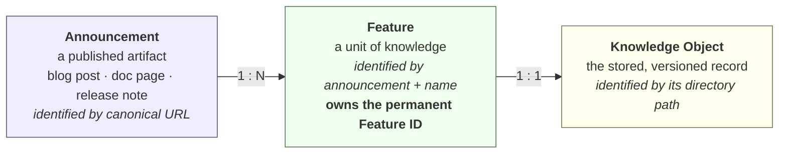

# Design proposal — Announcement, Feature, Knowledge Object

**Status:** Proposal for review. **Nothing here is implemented.**
**Decides:** whether ADR-0023 should be amended before M2
**Date:** 2026-07-31

---

## 1. The question

M1's validation found that the engine assumes **one announcement URL = one
feature**. Measured against production, that is false: one Microsoft announcement
routinely covers several independent features, so several distinct updates
collapse into one identity — and in M2 that becomes one permanent Feature ID with
the rest silently absent.

The proposal to evaluate:

> Should the pipeline distinguish **Announcement → Feature → Knowledge Object**,
> and should identity be computed from announcement URL, feature title, category
> and normalised feature text, rather than announcement URL alone?

Short answer: **the three-level model is correct and should be adopted.** Of the
four proposed identity components, **two must be included and two must be
excluded** — and the reasons for exclusion are empirical, not aesthetic.

But the measurements also surfaced a constraint that changes the sequencing: the
obvious fix is not currently safe to apply, and there is a prerequisite that has
to land first. §6 is the important section.

---

## 2. What the data says

All figures measured against the live Fabric "What's New" source
(`tools/identity_experiment.py`, run on a GitHub Actions runner).

### 2.1 The cardinality is genuinely one-to-many

| | Count |
|---|---|
| Rows discovered | 315 |
| Distinct announcement URLs | 214 |
| URLs cited by more than one row | 65 |
| …where all rows are the **same** feature (correct de-duplication) | 49 |
| …where rows are **distinct** features (the defect) | 16 |
| Distinct features currently lost to merging | 28 |
| Items citing an announcement host rather than a doc page | **75%** |

The largest cluster is a monthly summary post cited by **18 rows covering 11
distinct features**:

```
…/Fabric-June-2026-Feature-Summary/…
    Fabric Git Integration – GitHub Enterprise Cloud with Data Residency
    New default AI functions (Generally Available)
    Data agents in Microsoft 365 Copilot (Generally Available)
    Eventstream streaming connectors for Apache Kafka and Azure Service Bus
    CI/CD Support for SQL analytics endpoint (Preview)
    Conditional activity retries in Data Factory pipelines (Preview)
    …
```

These are not variations of one thing. They are independent features that happen
to have been announced on the same day. **The three-level model is not a
refinement; it describes reality, and the current model does not.**

### 2.2 Scoring the candidate identity schemes

| Scheme | Features | Agreement | Merged groups | Distinct lost |
|---|---|---|---|---|
| **url only** (today) | 214 | **98%** | 16 | 28 |
| **url + title** | 242 | **35%** | 0 | 0 |
| **url + title + category** | **315** | 34% | 0 | 0 |
| **title only** | 241 | 35% | 0 | 0 |

*Agreement* = share of the secondary representation's identities that the primary
also produced. It is a stability proxy, explained and qualified in §5.

Three things fall out of this table immediately:

1. **Adding the title fixes merging completely** — 16 merged groups → 0.
2. **Adding the title collapses stability** — 98% → 35%.
3. **Adding the category destroys identity outright** — 315 identities from 315
   rows means *every row* becomes its own feature, so even the 49 genuine
   repeats stop de-duplicating.

---

## 3. The model

Adopt three distinct concepts. They are currently conflated into one.



| Concept | Is | Is not | Identified by |
|---|---|---|---|
| **Announcement** | a source artifact that *reports* features | knowledge | canonical URL |
| **Feature** | the unit of knowledge | a document | announcement + feature name |
| **Knowledge Object** | the stored record of a Feature | a source artifact | its permanent path |

**The rule that follows:** an announcement is a *citation*, not an identity. It
says where knowledge was reported, not what the knowledge is. Today the engine
treats the citation as the identity, which is why two features reported in one
post cannot be told apart.

### 3.1 A modelling defect this exposes

`RawItem.source_url` currently falls back to the *source definition's own URL*
when a link cannot be resolved. Measured: 7 items carry
`raw.githubusercontent.com/.../whats-new.md` as their "announcement" — which is
the document being read, not an announcement at all.

Under the new model these must be distinguishable. `announcement_url` should be a
separate, **explicitly nullable** field. "This feature has no announcement" is a
fact worth representing; substituting the source document silently invents one
and would corrupt any per-announcement reporting.

---

## 4. Evaluating the four proposed identity components

### 4.1 Announcement URL — **include, as scope**

Its value is *not* discrimination. Measured, `title only` yields 241 features and
`url + title` yields 242 — the URL separates exactly **one** additional case out
of 242.

Its value is **scoping**: it prevents two different announcements that happen to
use the same feature name from colliding. Rare today, but the failure is silent
and permanent, and the cost of keeping it is one hash input.

> Note it does **not** add stability. A composite of two components changes when
> *either* changes, so `url + title` is strictly *less* stable than either alone.
> This is why agreement does not improve when the URL is added to the title.

### 4.2 Feature title — **include, as the discriminator**

The evidence is unambiguous: within a shared announcement, distinct features
always have distinct titles (0 merged groups under `url + title`), and repeated
rows of the same feature always share a normalised title (the 49 true repeats
still collapse correctly).

`normalise_title` already absorbs marketing rewording and word order. Its known
limit — verb changes — is documented in ADR-0023 and pinned by a test.

**This is the component that carries all the risk.** See §5.

### 4.3 Category / section — **exclude. Rejected on evidence.**

This is the strongest empirical finding in the analysis, and it rejects one of
the four proposed components outright.

**It is many-to-many.** 67 of 242 features (**28%**) appear under more than one
section. Including category would mint a separate permanent Feature ID for each:

```
"New SQL analytics endpoint metadata sync option (preview)"  → 3 IDs
    Fabric Data Engineering
    Fabric Data Warehouse
    Features currently in preview
```

**It is time-varying.** Sections encode lifecycle state — "Features currently in
preview" and "Generally available features" are both section headings. When a
feature reaches GA it *moves between sections*, so its identity would change and
a second permanent ID would be minted. That directly contradicts **ADR-0009**
(one ID per concept; GA is recorded as a revision, not a new object).

**It destroys de-duplication.** `url + title + category` produced **315
identities from 315 rows** — one per row. Even the 49 genuine repeats stop
collapsing.

> Category is knowledge *about* a feature. It belongs in `tags` and `category`,
> where the user can override it. Anything a human may reasonably re-file must
> never be part of a permanent identifier.

### 4.4 Normalised feature text — **exclude. Structurally contradictory.**

Summary text changes whenever documentation is edited. Including it means every
wording change mints a new permanent Feature ID.

More fundamentally, it **collides with the revision mechanism**. `content_hash`
over title+summary is precisely how the engine detects *that a feature changed*
so it can append a revision (ADR-0020). If the same bytes also determined
identity, then "this feature changed" and "this is a different feature" would be
the same signal — and revisions could never be recorded at all.

This is already why content fingerprint sits at rank 4 in ADR-0023: it changes
whenever anything changes, which is exactly when identity must not.

### 4.5 Summary

| Component | Verdict | Reason |
|---|---|---|
| Announcement URL | **Include** — as scope | Prevents cross-announcement collisions; cheap |
| Feature title | **Include** — as discriminator | The only thing that separates features within an announcement |
| Category | **Exclude** | 28% multi-section; time-varying with lifecycle; shatters de-duplication |
| Normalised text | **Exclude** | Would destroy the revision mechanism |

---

## 5. The constraint that changes the sequencing

`url + title` scores **35% agreement** where `url only` scores 98%. That number
needs careful interpretation, and then it needs to be taken seriously.

### What the number actually measures

The two representations title rows by different rules **by construction**: the
HTML adapter takes the first linked text, the Markdown adapter takes the first
content cell. So the 35% is not "titles get reworded 65% of the time". It is:

> **If the way a title is obtained changes, ~65% of title-derived identities
> change with it.**

That is an upper bound on rewording risk, and it overstates week-to-week churn.
**But it is an exact measure of something else that matters more**, and this is
the part that must not be waved away:

> Under composite identity, **failing over from the primary to the secondary
> would churn roughly two-thirds of all Feature IDs.**

The fallback chain — the thing M1 built to protect against Learn becoming
unreachable — would become a mass duplicate-ID generator the first time it
fired, automatically, with no human present. Power BI is worse: **5% agreement**.

So the fix for the merging defect, applied today, would trade a known 28-feature
loss for an unbounded duplication event on a day nobody is watching. That is not
an improvement.

### The prerequisite

The 35% is caused by **inconsistent title extraction**, not by unstable sources.
That is a defect in our adapters, and it is fixable:

- Define one title-selection rule and apply it in every adapter (candidate: the
  first non-date content cell, falling back to the linked text — the rule that
  matches how the source visually presents a feature name).
- Add a CI assertion that cross-representation title agreement stays above a
  threshold, so it cannot silently regress.
- Re-measure with `tools/identity_experiment.py`.

**Composite identity becomes safe once agreement is high, and not before.** The
target is agreement in the same range as URL-only (≥90%); if it cannot be reached,
composite identity should not be adopted and Option C below becomes the answer.

---

## 6. Options

| | Merging fixed? | Stability | Failover safe? | Reversible? |
|---|---|---|---|---|
| **A.** Composite now | Yes | 35% | **No** | No — IDs are permanent |
| **B.** Unify titles, then composite | Yes | to be measured | Yes, if ≥90% | No, but validated first |
| **C.** Keep URL identity, flag collisions | No — deferred | 98% | Yes | **Yes** |
| **D.** Host-class rule | ~80% | mixed | Partly | No |

**A — Adopt composite immediately.** Correct model, correct components, wrong
moment. Rejected on the failover evidence.

**B — Unify title extraction, verify, then adopt composite.** *Recommended.*
Fixes the model properly and pays down the defect that makes it unsafe. Costs one
extra step before M2.

**C — Keep URL-only identity; make merging visible instead of silent.** When one
identity resolves to more than one distinct normalised title, emit a review item
rather than merging. Nothing is lost silently, no wrong IDs are minted, and the
decision stays open. Today that surfaces 16 cases covering 28 features.
This is the **safe interim** and composes with B.

**D — Treat announcement hosts as non-identifying.** My earlier suggestion in the
M1 review. The measurements weakened it: 3 of 16 merging groups are
`learn.microsoft.com`, so it fixes only ~80% of the defect while still pushing
75% of the pack onto title-derived identity. It buys most of B's risk for less
than B's benefit. Withdrawn.

### Recommendation

**C now, B before M2 mints anything.**

1. Adopt the three-level model as the vocabulary (Announcement / Feature /
   Knowledge Object), and make `announcement_url` a separate nullable field.
2. Ship **C** so no distinct feature is ever silently merged — collisions become
   review items.
3. Unify title extraction across adapters and re-measure agreement.
4. If agreement ≥90%, amend ADR-0023 and adopt composite identity (**B**), and
   retire C's review path to a validation check.
5. If agreement cannot reach 90%, keep C permanently: visible, human-resolved
   merging is better than automated duplication.

This sequence has the property that matters most here: **every step is safe to
take before the next one is decided**, and none of them mints a permanent ID that
a later step would regret.

---

## 7. Impact on ADR-0023

ADR-0023 is **not wrong**; it is under-specified. It says identity comes from the
most durable signal available and ranks four bases. What it does not say is *what
identity is of* — and it silently assumes one URL identifies one feature.

Proposed amendment, as a new ADR superseding parts of 0023:

1. **State the unit.** Identity identifies a **Feature**, not a document. An
   announcement URL identifies an Announcement, which may contain many Features.
2. **Keep the hierarchy** for choosing the announcement anchor — canonical URL,
   source identifier, title hash, content fingerprint, in that order. That part
   has held up: 98% agreement is a strong result.
3. **Add the feature key** as a second dimension, composed with the anchor.
4. **Record what identity was computed from** in provenance — `identity_basis`
   already exists; it gains a `feature_key_basis` companion so an object can
   explain its own ID years later.
5. **Rule out category and content** from identity explicitly, with the
   measurements above as the recorded justification. Without this, both will be
   proposed again.

ADR-0009 (one ID per concept, GA as a revision) is **reinforced**, not changed —
it is the main reason category must stay out.

The existing "Negative" consequences in ADR-0023 remain accurate. One is
promoted: *"A moved article changes its URL and therefore its identity"* becomes
materially more likely under a composite scheme, and is the strongest remaining
argument for Option C.

---

## 8. What is not being proposed

- **No AI.** Deciding whether two rows are the same feature by model inference
  would be non-deterministic and is forbidden by ADR-0004.
- **No run-time cardinality rules.** "Merge only if the titles also match within
  this run" is run-dependent: identity would change when a row stops appearing.
  Permanence forbids it.
- **No retroactive change.** No Feature IDs exist yet. This is the entire reason
  the decision is cheap right now, and it stops being cheap the moment M2 runs.

---

## 9. Open questions for the maintainer

1. **Is the 90% agreement threshold the right bar** for adopting composite
   identity, or should it be higher given that IDs are permanent?
2. **Should Option C's review items block a run** or simply queue? My assumption
   is queue — blocking would let one ambiguous row stop a weekly harvest.
3. **Power BI**: with 5% agreement and no dates, should its objects be minted at
   all in M2, or should the pack wait until a better source exists?
