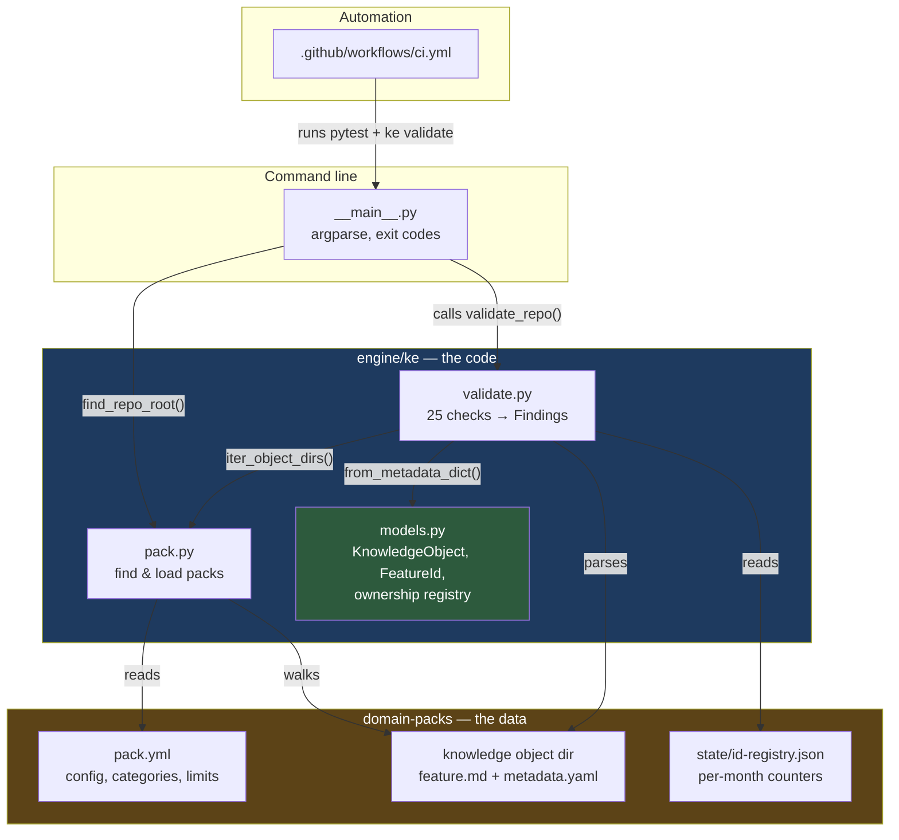
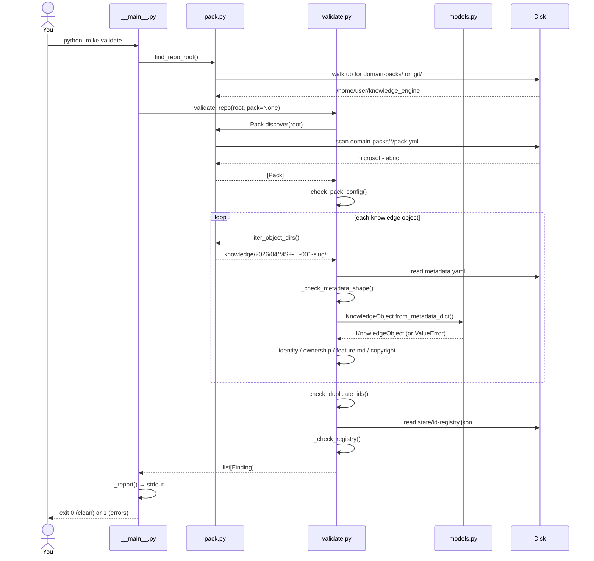

# Developer Playbook — M0: Foundation, Schema and Guardrails

This document teaches you the M0 codebase file by file: why each piece exists,
what problem it solves, how it connects to everything else, and how to change it
safely.

Read `docs/learning/M0_LEARNING_GUIDE.md` first if the Python concepts
(packages, dataclasses, enums) are new to you. This playbook assumes you know
what they are and focuses on *this* codebase.

---

## 1. What M0 is, and what it deliberately is not

M0 builds **no pipeline**. Nothing fetches a feed, mints an ID or writes a
knowledge object yet. That is intentional.

M0 builds the things that must exist *before* the pipeline, because they are
almost impossible to retrofit:

| Built in M0 | Why it cannot wait |
|---|---|
| The schema contract | Once objects exist on disk, changing their shape means migrating them |
| Feature ID rules | IDs are permanent; a format mistake is permanent too |
| Field ownership | Retrofitting write-protection after the pipeline exists means auditing every write |
| `ke validate` | A rule nobody checks is a rule that quietly stops being true |
| CI | Guardrails that only run when someone remembers are not guardrails |

The single most important idea in M0 is **field ownership** (§4). Everything
else is scaffolding around it.

---

## 2. Folder structure

```
knowledge_engine/
├── pyproject.toml            How the project is assembled and installed
├── CLAUDE.md                 The project's non-negotiable rules
├── README.md                 Orientation for a new reader
├── .gitignore
│
├── docs/
│   ├── SCHEMA.md             The contract ke validate enforces
│   ├── playbook/             This document
│   └── learning/             Concept teaching
│
├── engine/                   ← ALL CODE. Nothing outside this is code.
│   ├── ke/                   The installable package
│   │   ├── __init__.py       Package marker, version, SCHEMA_VERSION
│   │   ├── __main__.py       CLI: `python -m ke validate`
│   │   ├── models.py         What a knowledge object IS
│   │   ├── pack.py           Finding and loading Domain Packs on disk
│   │   └── validate.py       Checking everything against the contract
│   └── tests/                Test suite (91 tests)
│       ├── conftest.py       Shared fixtures and builders
│       ├── test_models.py    34 tests
│       ├── test_validate.py  42 tests
│       ├── test_pack.py      9 tests
│       └── test_cli.py       6 tests
│
├── domain-packs/             ← ALL DATA. Nothing here is code.
│   └── microsoft-fabric/
│       ├── pack.yml          Pack configuration
│       ├── knowledge/        Knowledge objects (empty until M2)
│       ├── indexes/          Generated indexes (empty until M3)
│       ├── digests/          Weekly summaries (empty until M6)
│       └── state/            Engine bookkeeping
│           ├── id-registry.json
│           ├── seen.json
│           └── run-log.md
│
└── .github/workflows/
    └── ci.yml                Tests + validation on every push
```

### The one structural rule

**`engine/` is code. `domain-packs/` is data. Neither knows the other's
specifics.**

`engine/` contains no mention of "microsoft-fabric" anywhere. It discovers packs
by scanning a directory. This is why M8 can add a Power BI pack and prove that
`git diff engine/` is empty — and why `engine/` can later become its own
repository by moving one folder.

If you ever find yourself writing `if pack.name == "microsoft-fabric":` inside
`engine/`, that is the rule breaking. The fix is almost always to move the
decision into `pack.yml` as data.

---

## 3. Architecture



**Dependency direction matters.** `models.py` imports nothing from the rest of
the package — it is the bottom of the stack. `pack.py` imports nothing from
`validate.py`. `validate.py` imports both. `__main__.py` sits on top.

Arrows never point backwards. If you ever need `models.py` to import
`validate.py`, something has been placed in the wrong module.

---

## 4. `engine/ke/models.py` — the heart (720 lines)

### Why it exists

Everything else in the engine manipulates knowledge objects. This file is the
single place that answers *what a knowledge object is*. If the definition lived
in several places, they would drift.

It is **dependency-free** — standard library only, not even PyYAML. That is
deliberate: the definition of a knowledge object should not depend on the file
format it happens to be stored in. Serialisation is a method *on* the model, not
a reason for the model to import a YAML library.

### What is inside

#### 4.1 Controlled vocabularies (the enums)

```python
class Difficulty(StrEnum):
    BEGINNER = "beginner"
    INTERMEDIATE = "intermediate"
    ADVANCED = "advanced"
```

**Problem solved:** without these, `difficulty` would be a free-text string, and
within a year the pack would contain `"intermediate"`, `"Intermediate"`,
`"medium"` and `"moderate"` — all meaning the same thing, none of them
groupable.

`StrEnum` (Python 3.11+) means `Difficulty.BEGINNER == "beginner"` is `True` and
it writes to YAML as a plain string. You get validation in code *and* a file a
human can read in the GitHub UI without knowing Python.

The enums: `DateConfidence`, `SourceAuthority`, `Tier` (an `IntEnum`, because
tiers are 1/2/3), `LearningPriority`, `Difficulty`, `Workload`, `LearningStatus`,
`ObjectStatus`, `ArtifactType`, `GenerationStatus`.

> **Note `ObjectStatus` has no `DELETED` member.** That is not an oversight. The
> repository rule is that knowledge is never deleted, so the vocabulary makes
> deletion literally unrepresentable.

#### 4.2 `FeatureId`

```python
@dataclass(frozen=True, order=True)
class FeatureId:
    prefix: str      # MSF
    year: int        # 2026
    month: int       # 4
    sequence: int    # 1
```

Renders as `MSF-2026-04-001`.

- `frozen=True` — immutable. A Feature ID is permanent, so the object modelling
  it cannot be mutated. Attempting `fid.year = 2027` raises.
- `order=True` — sortable, so `sorted(ids)` gives chronological order for free.
- `__post_init__` validates through the same regex used for parsing, so an ID
  built in code and one read from disk can never disagree.

Key members:

| Member | Returns | Used by |
|---|---|---|
| `parse("MSF-2026-04-001")` | `FeatureId` | Loading metadata |
| `str(fid)` | `"MSF-2026-04-001"` | Writing metadata |
| `month_key` | `"2026-04"` | The `id-registry.json` counter bucket |
| `knowledge_subpath` | `"2026/04"` | Where the object lives on disk |
| `directory_name(slug)` | `"MSF-2026-04-001-direct-lake-ga"` | Object folder name |

**Why per-month counters.** Backfilling an article published in November 2025
mints `MSF-2025-11-00N` without disturbing the April 2026 counter. A single
global counter would make every backfill renumber the future.

#### 4.3 The field ownership registry — read this twice

This is the most important 60 lines in the codebase.

**The problem.** Your `metadata.yaml` contains two kinds of information mixed
together in one file:

- Facts from Microsoft: title, URL, publication date.
- **Your own work**: `learning_status`, `notes`, the relationships you curated.

A job runs every Sunday and rewrites those files. Without an explicit rule, the
day Microsoft edits an article, that job overwrites the file — and your notes are
gone. Git would have the history, but you would not know to look.

**The solution.** Every field belongs to exactly one class:

```python
ENGINE_OWNED_FIELDS    = frozenset({"title", "source_url", "content_hash", ...})
ENGINE_PROPOSED_FIELDS = frozenset({"tier", "difficulty", "tags", ...})
USER_OWNED_FIELDS      = frozenset({"learning_status", "notes", "prerequisites", ...})
```

Three assertions run at **import time**:

```python
assert not (ENGINE_OWNED_FIELDS & ENGINE_PROPOSED_FIELDS)
assert not (ENGINE_OWNED_FIELDS & USER_OWNED_FIELDS)
assert not (ENGINE_PROPOSED_FIELDS & USER_OWNED_FIELDS)
```

`&` is set intersection. If a field is ever accidentally listed in two classes,
**the package refuses to import** — you find out on your next test run, not at
3am on a Sunday when the cron corrupts a file.

The gate itself:

```python
def is_engine_writable(field_name, overrides):
    ownership = ownership_of(field_name)
    if ownership is Ownership.ENGINE:   return True
    if ownership is Ownership.USER:     return False
    return field_name not in overrides   # PROPOSED: writable unless locked
```

And the door every automated write must pass through:

```python
def with_engine_fields(self, **updates):
    locked = set(self.overrides)
    for name in updates:
        if not is_engine_writable(name, locked):
            raise PermissionError(...)
    return replace(self, **updates)
```

**Note what this returns: a *copy*.** `dataclasses.replace()` builds a new object
rather than mutating the existing one. Combined with `PermissionError`, this
means an incorrect write cannot half-succeed.

Try it:

```bash
python -m pip install -e ".[dev]"
python -c "
from ke.models import *
from datetime import date
obj = KnowledgeObject(
    id=FeatureId.parse('MSF-2026-04-001'), slug='x', title='X',
    source_name='s', source_url='u', source_authority=SourceAuthority.THIRD_PARTY,
    discovered_date=date.today(), date_confidence=DateConfidence.EXACT,
    content_hash='h', url_hash='h', notes='my notes')
obj.with_engine_fields(notes='clobbered')
"
# PermissionError: engine may not write 'notes' (user-owned)
```

`ownership_of()` raises `KeyError` for an unknown field rather than returning a
default. A typo in engine code must not silently acquire write permission it was
never granted.

#### 4.4 `KnowledgeObject`

The main dataclass. ~30 fields grouped by ownership, with `to_metadata_dict()`
and `from_metadata_dict()` for serialisation.

`to_metadata_dict()` writes the field order **explicitly** rather than using
`dataclasses.asdict()`. That is a deliberate trade: more code, but the YAML comes
out in the order a human reads it (identity, then provenance, then
classification, then your learning state) instead of in declaration order.

Derived properties do the arithmetic once so nothing else has to:

- `current_revision` → highest revision number, `0` if none
- `directory_name` → `MSF-2026-04-001-direct-lake-ga`
- `knowledge_subpath` → `2026/04/MSF-2026-04-001-direct-lake-ga`
- `stale_artifacts()` → artifact types generated before the current revision

#### 4.5 Staleness is computed, not stored

```python
def is_stale_against(self, current_revision):
    if self.status not in (GENERATED, STALE):    return False
    if self.generated_from_revision is None:     return False
    return self.generated_from_revision < current_revision
```

If a tutorial was generated from revision 1 and the object is now at revision 2,
the tutorial is stale. **Derived, not remembered** — there is no flag anyone
could forget to set, and the weekly pipeline can report staleness without ever
calling an AI model.

### How to modify it safely

**Adding a field** — do all four, or `ke validate` will fail loudly (which is the
system working):

1. Add it to the `KnowledgeObject` dataclass.
2. Add it to exactly **one** ownership frozenset.
3. Add it to `to_metadata_dict()` and `from_metadata_dict()`.
4. Document it in `docs/SCHEMA.md`.

`test_every_serialised_field_has_a_declared_owner` catches you if you skip step 2.

**Adding an enum value** — safe. Old files keep loading.

**Removing or renaming a field** — needs `schema_version` bumped to 2 and a
migration in M9. Existing files on disk still contain the old name.

---

## 5. `engine/ke/pack.py` — finding data on disk (165 lines)

### Why it exists

`validate.py` should not know that packs live in `domain-packs/`, that config is
in `pack.yml`, or that objects nest under `knowledge/YYYY/MM/`. One module owns
those facts.

### Key parts

```python
@dataclass(frozen=True)
class Pack:
    root: Path
    config: dict[str, Any]
```

**`Pack.load(root)`** reads and parses `pack.yml`, raising `PackError` if missing
or malformed. **`Pack.discover(repo_root)`** scans `domain-packs/` and returns
every directory containing a `pack.yml`, sorted.

`discover()` is what makes M8 cheap: the weekly workflow loops over whatever it
returns, so adding a pack is creating a folder — no workflow edit.

**`iter_object_dirs()`** walks `knowledge/<year>/<month>/<object>` and yields
every directory at that depth:

```python
for year_dir in sorted(...):
    for month_dir in sorted(...):
        yield from sorted(p for p in month_dir.iterdir() if p.is_dir())
```

It deliberately yields **malformed** directories too — one missing its
`metadata.yaml` still gets yielded, so `validate.py` can report it. A generator
that skipped broken objects would hide exactly what the validator exists to find.

`yield from` re-emits every item of an inner iterable. `sorted()` at each level
gives deterministic, chronological ordering.

**`find_repo_root(start)`** walks *up* from a directory looking for
`domain-packs/` or `.git/`, so `ke validate` works from anywhere in the checkout.

### How to modify it safely

Adding a config key: add a property with a sensible default (see
`max_summary_words`, which falls back to `DEFAULT_MAX_SUMMARY_WORDS`). Never
`config["new_key"]` directly — that raises `KeyError` on every pack that predates
the key.

---

## 6. `engine/ke/validate.py` — the guardrail (523 lines)

### Why it exists

`CLAUDE.md` says "avoid duplicate Feature IDs". That sentence changes nothing
unless something checks it. This file is the something.

### The `Finding` pattern

```python
@dataclass(frozen=True)
class Finding:
    level: Level      # ERROR or WARNING
    code: str         # "ID003"
    location: str     # path, relative to the pack
    message: str
```

Checks **return** findings rather than raising or printing. Three consequences:

1. One run reports *every* problem, not just the first.
2. Tests assert on `code`, so messages can be reworded without breaking tests.
3. The caller decides what a finding means — `--strict` turns warnings fatal.

### Check inventory

| Family | Codes | Guards against |
|---|---|---|
| Pack | `PACK000`–`PACK004` | Missing keys, unsupported version, bad prefix, missing dirs |
| Object | `OBJ001`–`OBJ005` | Wrong directory name, missing/unparseable files |
| Schema | `SCHEMA001`–`SCHEMA005` | Bad version, missing/unknown fields, bad enums, undeclared category |
| Identity | `ID002`–`ID004` | Wrong prefix, **duplicate IDs**, wrong month folder |
| Ownership | `OWN001`–`OWN002` | `overrides` locking a field it may not lock |
| Consistency | `CONS001`–`CONS002` | `feature.md` heading not matching `title` |
| Copyright | `COPY001` | Summary over the word limit |
| Registry | `REG001`–`REG005` | Counter collisions, unregistered or vanished objects |

### The registry checks are the subtle ones

```python
elif int(recorded) < used:
    # counter for 2026-04 is 3, but MSF-2026-04-007 exists
    # → the next mint would produce 004 … and eventually collide with 007
```

A counter **ahead** of what is on disk is explicitly fine — IDs are never reused,
so gaps are normal. A counter **behind** is a future duplicate-ID bug, caught
before it happens. `test_a_counter_ahead_of_disk_is_allowed` pins that.

`REG005` catches a registry entry pointing at an object that no longer exists —
which, since objects are never deleted, means something was lost.

### Early return on unparseable objects

```python
if any(f.level is Level.ERROR for f in schema_findings):
    return findings, None
```

`_check_object` returns `(findings, LoadedObject | None)`. An object that failed
schema checks returns `None` and is excluded from the duplicate-ID and registry
checks — running those on a half-parsed object produces confusing cascades.

### How to modify it safely

Adding a check: write a `_check_*` helper returning `list[Finding]`, call it from
`_check_object` or `validate_pack`, allocate the next code in its family,
document it in `docs/SCHEMA.md` §9, and **write the failing test first** — a
guardrail nobody proved fires is not a guardrail.

---

## 7. `engine/ke/__main__.py` — the CLI (102 lines)

Naming a module `__main__.py` inside a package makes `python -m ke` run it. The
`[project.scripts]` entry in `pyproject.toml` also installs it as `ke`.

Structure:

- `build_parser()` — `argparse` setup, one subparser per command
- `_run_validate(args)` — the handler, returns an exit code
- `_report(...)` — grouped, sorted output
- `main(argv=None)` — accepts an argument list so tests can call it directly

**Exit codes are the contract with CI:** `0` clean, `1` findings that fail,
`2` unusable pack. `test_cli.py` tests the codes, because that is what CI reads.

`set_defaults(handler=_run_validate)` attaches the function to the parsed args,
so `main()` dispatches with `args.handler(args)` and never grows an `if/elif`
chain as commands are added in M1–M9.

---

## 8. Execution flow



### End to end, in words

1. **You run** `python -m ke validate`.
2. Python sees `-m ke`, imports the `ke` package, runs `__main__.py`.
3. `argparse` parses `validate`; `args.handler` is `_run_validate`.
4. `find_repo_root()` walks up from the current directory.
5. `validate_repo()` calls `Pack.discover()`, which globs for `pack.yml` files.
6. For each pack: check `pack.yml`, then walk every object directory.
7. For each object: check files exist → parse YAML → check keys and version →
   build a `KnowledgeObject` (enum errors surface here) → check identity,
   ownership, `feature.md` consistency, word count.
8. Across objects: duplicate IDs, then registry integrity.
9. `_report()` groups findings by location, errors before warnings.
10. `has_errors()` decides the exit code. CI reads it.

---

## 9. Debugging tips

**`ModuleNotFoundError: No module named 'ke'`**
The package is not installed. `python -m pip install -e ".[dev]"` from the repo
root. The `-e` means edits take effect without reinstalling.

**Tests pass but `ke validate` behaves oddly**
You are probably running it from a different directory. Pass `--repo-root`
explicitly to be sure:
```bash
python -m ke validate --repo-root /home/user/knowledge_engine
```

**A validation error you do not understand**
Every message carries its code. Look the code up in §6 above or `docs/SCHEMA.md`
§9, then find it in `validate.py`:
```bash
grep -n "REG002" engine/ke/validate.py engine/tests/test_validate.py
```
The test shows exactly what triggers it.

**`AssertionError` on import**
The ownership frozensets overlap. You added a field to two classes. Check the
three `assert` statements near the bottom of the ownership section in
`models.py`.

**`KeyError: 'some_field'` from `ownership_of`**
A field reached serialisation without being declared in any ownership class.
Add it to exactly one frozenset.

**Seeing the raw findings in Python**
```python
from pathlib import Path
from ke.pack import Pack
from ke.validate import validate_pack
for f in validate_pack(Pack.load(Path("domain-packs/microsoft-fabric"))):
    print(f)
```

**Run one test loudly**
```bash
python -m pytest engine/tests/test_validate.py::test_duplicate_feature_id_is_reported -v
python -m pytest engine/tests -q -x        # stop at first failure
python -m pytest engine/tests -k registry  # only registry tests
```

**Inspect what CI will do**
CI runs exactly three things: `pip install -e ".[dev]"`, `pytest engine/tests -q`,
`python -m ke validate`. If those pass locally, CI passes.

---

## 10. Glossary

| Term | Meaning |
|---|---|
| **Domain Pack** | One knowledge repository for one subject (Microsoft Fabric, Power BI…). Pure data under `domain-packs/`. |
| **Knowledge object** | One unit of knowledge. A **directory** containing `feature.md`, `metadata.yaml`, `artifacts/`, `images/`, `references/`. |
| **Feature ID** | `MSF-2026-04-001`. Permanent, never reused, month from publication date (or discovery if unknown). |
| **Engine-owned** | Fields the engine may rewrite freely (title, hashes, dates). |
| **Engine-proposed** | Fields the engine guesses but you may lock via `overrides` (tier, difficulty, tags). |
| **User-owned** | Fields the engine must never write (`learning_status`, `notes`, relationships). |
| **`overrides`** | List of engine-proposed field names you have locked. |
| **Revision** | A numbered record that the source changed. Append-only. |
| **Stale** | A generated artifact whose source knowledge has been revised since. Marked, never deleted. |
| **Tier** | Operational impact: 1 act now, 2 learn soon, 3 awareness. |
| **Learning priority** | Content value — independent of tier. |
| **Finding** | One validation result: level, code, location, message. |
| **Context pack** | Self-contained Markdown `ke generate` will produce (M7) for pasting into any AI model. |
| **`schema_version`** | Version of the `metadata.yaml` **layout**. Not the product version — that is `version`. |
| **Fixture** | A pytest function providing pre-built test data (see `conftest.py`). |

---

## 11. Where M1 plugs in

M1 adds discovery. Nothing in M0 changes shape:

```
engine/ke/sources/
├── base.py          Source protocol — fetch() -> list[RawItem]
├── rss.py           RSS/Atom feeds
├── sitemap.py       Sitemap crawling
└── github_docs.py   Commits to public docs repos
engine/ke/normalize.py   canonical URL, HTML→text, date + confidence
```

`RawItem` already exists in `models.py` and already carries `id_basis_date`,
which implements the publication-month-with-fallback rule. `pack.yml` already has
an empty `sources: []` waiting to be filled — after the URLs are verified.

**The known blocker:** no source URL has been validated. The planning environment
blocks `*.microsoft.com`, so the candidates sit in `pack.yml` as comments. M1's
first task is fetching each one from a GitHub runner and recording its real
response format. A pinned unverified URL looks identical to a validated one,
which is why none were pinned.
