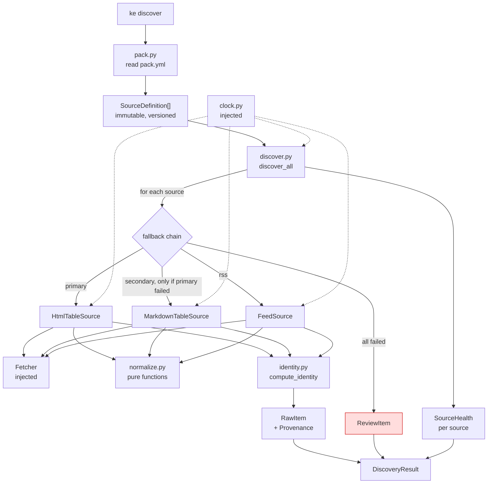
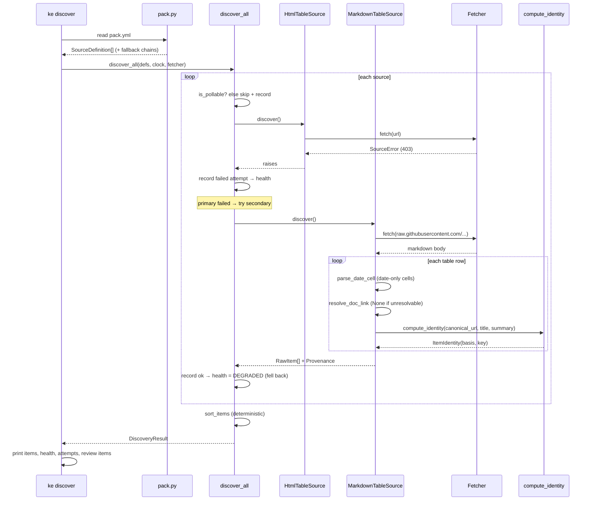

# Developer Playbook — M1: Discovery

**Milestone:** M1
**Status:** Complete, pending review
**Audience:** anyone who has to change, debug or extend discovery — including
future-you, six months from now, at 11pm, when the weekly run has gone quiet.

---

## 1. What M1 is, and what it deliberately is not

M1 makes the engine **look at the internet and tell you what it found**.

It fetches every configured source, parses each into normalised items, computes a
stable identity for each item, records how each item was obtained, tracks whether
each source is healthy, falls back when one fails, and prints the result.

**M1 writes nothing.** No knowledge objects, no Feature IDs, no state files. That
is not an oversight — it is the single most useful property of this milestone.
Feature IDs are permanent (ADR-0005) and identity is what they are minted from
(ADR-0023), so discovery is the last moment where a mistake is still free. M2
turns these items into permanent objects; until then every run can be thrown away
and repeated.

The practical consequence: **you can run `ke discover` as often as you like
against production and break nothing.** Use that.

| M1 does | M1 does not |
|---|---|
| Fetch, parse, normalise | Store anything |
| Compute item identity | Mint Feature IDs |
| Record provenance | Write `metadata.yaml` |
| Track source health in memory | Persist health to disk (M6) |
| Fall back on failure | Retry or back off |
| Report review items | Notify anybody (M6) |

---

## 2. Folder structure

Everything M1 added or changed:

```
engine/ke/
├── clock.py                  NEW  injected time — the replayability seam
├── identity.py               NEW  the four-level identity hierarchy
├── normalize.py              NEW  pure text/URL/date functions
├── discover.py               NEW  orchestration: chains, health, failure isolation
├── models.py                 GREW provenance, health, date precision, events
└── sources/
    ├── __init__.py           NEW  (empty — a package, not a module)
    ├── base.py               NEW  SourceDefinition, Fetcher, sort_items
    ├── html_table.py         NEW  PRIMARY adapter — Microsoft Learn pages
    ├── markdown_table.py     NEW  SECONDARY adapter — MicrosoftDocs repo
    └── feed.py               NEW  RSS/Atom adapter

tools/                        diagnostics, deliberately outside engine/
├── source_probe.py           is this URL real and usable?
├── html_structure_probe.py   is this page server-rendered or a JS shell?
├── access_diagnostic.py      why is Learn refusing us, and is there an API?
└── fallback_probe.py         NEW  do primary and secondary agree on identity?

domain-packs/microsoft-fabric/pack.yml   sources pinned, with fallback chains
docs/adr/0017–0026                       the decisions behind all of the above
```

### Why `tools/` is not in `engine/`

The probes are throwaway-grade code that answers a question once. They are not
imported by the engine, not tested, and not held to its standards. Keeping them
outside `engine/ke/` means "is this production code?" is answered by the path
rather than by reading it. When a probe's answer matters permanently, it gets
written into `docs/reviews/`, not preserved as code.

---

## 3. Architecture

### The shape



The two boxes shaded blue are **injected seams**: the clock and the fetcher. They
are the reason every adapter is testable offline and the reason a run can later be
replayed (ADR-0021, ADR-0025). Nothing in `engine/ke/` calls `datetime.now()` or
opens a socket except through them — and that is enforced by a test, not by
convention:

```python
def test_no_engine_module_reads_the_clock_directly():
    # walks every .py under engine/ke/ looking for datetime.now( / date.today(
```

### The layering rule

```
adapters  ──▶ normalize, identity, models     (may import)
adapters  ──▶ discover                        (MUST NOT — inverted)
discover  ──▶ adapters                        (may import)
```

Adapters **fetch and parse**. They never decide what happens when they fail —
they raise `SourceError` and `discover.py` decides. This is why one dead source
cannot take out the run: the decision lives in exactly one place.

### The one rule that matters most

> **A failed source never fails the run.** — ADR-0019

Read `_attempt()` in `discover.py` and notice it catches bare `Exception`, which
is normally a smell. It is deliberate here and commented as such: an adapter *bug*
must be recorded and survived, not allowed to end the run. A crash in one adapter
would otherwise take every other source down with it — and, worse, prevent the
run-log commit that stops GitHub auto-disabling the weekly cron after 60 quiet
days.

---

## 4. `engine/ke/clock.py` — injected time (93 lines)

### Why it exists

Every timestamp the engine writes is permanent. `discovered_date` feeds Feature ID
minting when a publication date is missing (ADR-0005), so "what time is it?" is a
question with permanent consequences — and one that a test must be able to answer
differently from production.

### What is inside

```python
class Clock(Protocol):
    def now(self) -> datetime: ...       # UTC, timezone-aware
    def today(self) -> date: ...
    def run_id(self) -> str: ...         # "run-2026-08-02T06-00-00Z"

class SystemClock:  ...    # production
class FrozenClock:  ...    # tests: one fixed instant, forever
```

### The two details worth knowing

**`run_id()` is stable within a run.** `SystemClock` computes it once at
construction. If it recomputed per call, two items from the same run would carry
different run IDs and the run log could never be joined to the objects it
produced.

**`FrozenClock` rejects a naive datetime.** An ambiguous instant in a permanent
history is worse than no instant, so it raises `ValueError` rather than guessing
a timezone.

### How to modify it safely

Adding a method to the Protocol means updating both implementations. Never add a
method that returns *elapsed* time — duration belongs to the fetcher, and mixing
the two makes replay ambiguous.

---

## 5. `engine/ke/identity.py` — the duplicate-ID guard (161 lines)

### Why it exists

This is the highest-stakes file in M1. Read ADR-0023 before changing it.

M1's primary source is a web page whose updates are **table rows carrying no
identifier of any kind**. If Microsoft reorders the table or rewords a heading, a
naive matcher sees new rows — and M2 mints **new permanent Feature IDs for
knowledge already stored**. IDs are never reused and never renumbered, so
duplicates created this way can never be cleaned up.

### The hierarchy

```python
def compute_identity(canonical_url=None, source_identifier=None,
                     title=None, summary=None) -> ItemIdentity
```

Tried in order, most durable first:

| Order | Basis | Survives | Durable? |
|---|---|---|---|
| 1 | `canonical-url` | rewording, reordering, full markup change | yes |
| 2 | `source-identifier` | anything, when the source publishes one | yes |
| 3 | `normalised-title-hash` | marketing rewording, word order | no |
| 4 | `content-fingerprint` | nothing much — last resort | no |

None of the four available? **`ValueError`.** Failing loudly beats fabricating an
identity that will collide later.

### The normalisation trick

`normalise_title` lower-cases, strips punctuation, removes marketing noise
(`TITLE_NOISE`), and **sorts the words**. Sorting is what makes these agree:

```
"Announcing general availability of Direct Lake"
"Direct Lake is now generally available"
        → both normalise to "direct lake"
```

### The known limitation, pinned by a test

Title identity does **not** survive a verb change (`"X enters preview"` vs
`"X reaches GA"`). Extending `TITLE_NOISE` to every lifecycle verb would mean an
ever-growing list that steadily raises the chance of two genuinely different
features colliding — a worse failure than a missed match. That is exactly why the
title hash is *third* in the hierarchy, and there is a test named
`test_title_identity_does_not_survive_a_verb_change` so nobody mistakes it for a
bug and "fixes" it.

### How to modify it safely

- **Never reorder the hierarchy** without an ADR. It is the contract M2 depends on.
- Adding to `TITLE_NOISE` widens collisions. Every addition needs a test proving
  two *different* features still separate.
- `raw_value` records what was hashed. Keep it — every duplicate investigation
  starts with "what were we matching on?".

---

## 6. `engine/ke/normalize.py` — pure functions (211 lines)

Every function here is **pure**: same input, same output, no clock, no network.
That is what makes discovery replayable and adapters testable.

| Function | Job | Trap it avoids |
|---|---|---|
| `canonical_url` | strip tracking, sort params, drop fragment | two URLs for one article → two Feature IDs |
| `content_hash` | fingerprint title+summary | reflowed paragraph read as a revision |
| `html_to_text` | visible text only | `<script>` contents in a summary |
| `truncate_summary` | enforce the word cap | ADR-0003 copyright rule, one source ships 29,000-char articles |
| `slugify` | filesystem-safe directory name | unstable object paths |
| `parse_date` | most precise date present | matching "July 2026" inside "July 15, 2026" and losing the day |
| `parse_date_cell` | date **only** from a date-only cell | **see below** |

### `parse_date_cell` — found by measurement, not by reasoning

The adapters originally searched the whole row for a date. Against the real page
that produced this:

```
| **Data Factory gateway manual update (Preview)** | The [Gateway
  December 2025 release](...) adds a manual update option. |
```

"December 2025" was scraped out of a **sentence**, labelled `EXACT`, and would
have become a permanent Feature ID under ADR-0005. It affected 1 row in 361:
rare, silent, and unfixable afterwards.

`DATE_ONLY_CELL` is anchored (`^...$`) so only a cell containing *nothing but* a
date is trusted. Everything else returns no date, and the caller falls back to
the discovery month — which is honest.

> **If you take one thing from this playbook:** the bug was invisible in the
> fixture and obvious in production. Measure the source.

---

## 7. `engine/ke/sources/base.py` — the source contract (190 lines)

### `SourceDefinition` — immutable and permanent

```python
@dataclass(frozen=True)
class SourceDefinition:
    name: str
    adapter: AdapterType
    url: str
    authority: SourceAuthority
    parser_version: int = 1
    status: SourceStatus = ACTIVE        # active|deprecated|disabled|replaced
    role: SourceRole = PRIMARY           # primary|secondary|manual-review
    fallbacks: tuple[SourceDefinition, ...] = ()
    options: dict = ...                  # adapter-specific config
```

**Never delete a source definition** (ADR-0024). Provenance on every object it
ever produced points at it by name. Retire one by moving `status` to `deprecated`,
`disabled` or `replaced`; `is_pollable` then stops it being fetched while keeping
the name resolvable forever.

`parser_version` is stamped onto every item. Bump it when extraction strategy
changes, so historical objects stay attributable to the parser that made them.

### The `Fetcher` Protocol

```python
class Fetcher(Protocol):
    def fetch(self, url: str) -> FetchResult: ...
```

One method, injected everywhere. An adapter that reached for the network itself
could only be tested against the live internet, and would become untestable the
day that source went down.

### `sort_items` — deterministic ordering

Sorts by `(published_date is None, published_date, identity.key)`. Undated items
sort last; identity breaks ties. Without this, output order would depend on
dictionary iteration and ADR-0022's byte-identical guarantee would be a fiction.

---

## 8. `engine/ke/sources/html_table.py` — the primary (261 lines)

### Why it is primary, reluctantly

Source validation found **no reachable purpose-built update feed**. Every
`blog.fabric.microsoft.com` and `powerbi.microsoft.com` feed returns 403 from a
GitHub runner, including with a browser User-Agent. The Microsoft Learn "What's
New" page is the highest-signal source that responds — so the HTML adapter carries
the load RSS was originally expected to. That inversion is the main architectural
finding of M1 (`docs/reviews/M1_SOURCE_VALIDATION.md`).

### The page shape, measured

- `<h2>` sections are **feature areas**, not months
- rows inside `<table>` are individual updates
- dates live **inside cells** as `Month YYYY`
- 23 tables, 730 links, 177 dates

### `WhatsNewParser`

A streaming `HTMLParser` subclass holding a small state machine: current section,
in-heading, in-row, in-cell, current anchor. It tracks the section heading as it
walks so every row knows its feature area — that heading becomes the classification
signal M3 uses, and it costs nothing to capture now.

One special case worth knowing: `"In this article"` is Learn's table-of-contents
heading, not a feature area. Letting it through would mislabel every row beneath it.

### Row → item

1. Find a date, but **only from a dedicated date cell**
2. Title = first link with visible text; else the longest non-date cell
3. Fewer than two words → not an update, skip
4. Summary = remaining cells, truncated to the pack's word cap
5. Identity from the canonical link target

### How to modify it safely

- An empty result **raises** rather than returning `[]`. Zero rows from a page
  that should be full of them is a parser break, not a quiet week — and the two
  must never be indistinguishable.
- Bump `adapter.version` in `pack.yml` when extraction changes.
- Add a fixture from the *real* page. Fixtures written from imagination are how
  the prose-date defect survived.

---

## 9. `engine/ke/sources/markdown_table.py` — the secondary (231 lines)

### Why it exists

`learn.microsoft.com/fabric` is generated from the public
`MicrosoftDocs/fabric-docs` repository. This adapter reads that source file
directly.

That makes it a **genuine** secondary: the same authoritative content, from
different infrastructure, with different failure modes. The previous fallback was
a feed of docs-repo merge commits — mechanically alive, but carrying commit
messages rather than knowledge. **A fallback that cannot produce what the primary
produces is not a fallback.**

### Why it is second rather than first

Markdown links are **relative document paths**:

```markdown
[Use Iceberg tables](../onelake/onelake-iceberg-tables.md#virtualize)
```

Identity's strongest signal is the canonical URL, and the rendered HTML supplies
those already resolved. Here they must be **reconstructed** — deterministic, but a
new failure mode sitting directly on the mechanism that prevents duplicate
permanent Feature IDs.

### `resolve_doc_link` — the function to read carefully

```python
resolve_doc_link("../onelake/direct-lake-ga.md#modes",
                 doc_path="docs/fundamentals/whats-new.md",
                 docs_prefix="docs/",
                 base_url="https://learn.microsoft.com/en-us/fabric")
# → "https://learn.microsoft.com/en-us/fabric/onelake/direct-lake-ga"
```

It returns **`None`**, never a guess, for: in-page anchors, non-`.md` targets, and
paths that escape the docs root.

> Fabricating a canonical URL would be worse than having none. Identity would look
> *durable* — ADR-0023's strongest basis — while resting on an invention, and the
> Feature ID minted from it is permanent. Returning `None` drops to a weaker basis,
> which is honest.

The three path parameters are **per-source configuration** in `pack.yml`, not
constants, so a second pack pointing at a different docs repository needs no code
change.

### Verified against production

Run against the live file, the adapter extracts **315 Fabric items**, **97% on a
reconstructed canonical URL**, 163 with month-precision dates, section headings
landing correctly. Power BI: 19 items, 0 dated — which is a property of that
source (its table has no date column), not a parser bug.

### The property that makes failover safe

The two representations must agree on **identity**, even where they disagree on
titles. They do disagree on titles: HTML takes the first linked text, Markdown
takes the first content cell, so a row whose feature name is bold text and whose
only link sits in the description is titled differently by each.

That is tolerable **only** because identity comes from the URL, not the title —
so failing over produces a revision at worst, never a duplicate permanent ID.
Pinned by `test_the_two_representations_agree_on_identity_even_when_titles_differ`.
If that test ever fails, the fallback chain is unsafe and must be disabled before
M2 runs.

---

## 10. `engine/ke/sources/feed.py` — RSS and Atom (152 lines)

The one place a dependency earns its keep: real-world feeds are inconsistent in
ways a hand-rolled parser discovers slowly and painfully, so `feedparser` handles
them.

Two things worth knowing:

**Truncation is mandatory, not tidy.** The Fabric blog feed ships
**29,000-character full articles**. ADR-0003 forbids storing full third-party
text, and this is where that rule is enforced at ingest rather than caught later
by `ke validate`.

**Feed IDs rank below URLs** in identity even though feeds publish them. A URL is
checkable by a human; an opaque feed id is not.

---

## 11. `engine/ke/discover.py` — orchestration (231 lines)

The only module that knows about fallback chains and failure handling.

### `_discover_chain` — try each link, stop at first success

```python
chain = (definition, *definition.fallbacks)
for link in chain:
    if link.role is MANUAL_REVIEW:
        break                      # terminal marker, not a real source
    attempt, items, reason = _attempt(...)
    result.health[link.name] = health.record(attempt)
    if attempt.ok:
        result.items.extend(items)
        return
result.review_items.append(ReviewItem(...))     # every link failed
```

### `ReviewItem` — why it is not an empty list

> "No updates" and "we could not look" must never be indistinguishable.

A chain that fails completely produces something a human will see. An empty list
would be silently absorbed into a quiet week, and weeks of silent data loss is the
failure mode this engine exists to avoid.

### Health states

`healthy` · `degraded` · `failed` · `disabled`. The one to understand is
**`degraded`**: reachable and returning items, but either falling back to a
secondary *or* returning far fewer items than its historical median. A source that
always returns twenty items and suddenly returns one has probably broken.
Median-based, so one quiet week does not trip it.

---

## 12. Execution flow



### In words

1. `pack.py` reads `pack.yml` into immutable `SourceDefinition`s including chains.
2. `discover_all` skips non-pollable sources (recording them), then walks each chain.
3. Each adapter fetches through the injected `Fetcher` and parses to `RawItem`s.
4. Each item computes its identity and carries a `Provenance` record naming every
   link in the discovery chain.
5. Failures become recorded `SourceAttempt`s, never exceptions that escape.
6. A fully failed chain produces a `ReviewItem`.
7. Items are sorted deterministically and printed. **Nothing is written.**

---

## 13. Debugging tips

**Discovery prints nothing for a source.**
Check `is_pollable` first — a `disabled` or `replaced` status is a silent skip by
design, and it is reported in `result.skipped`, not in the items.

**A source is `degraded` but looks fine.**
Two different causes: it fell back to a secondary, or its item count collapsed
against the historical median. `health.last_failure_reason` distinguishes them —
"parser break" means the count check fired.

**Items appear with wrong or missing dates.**
Check `provenance.selector`. It records `(date from cell N)` or `(no date cell)`,
so you can tell "the source has no date column" from "we failed to read one"
without re-fetching.

**Two items you expected to be one.**
Read `identity.basis` and `raw_value`. If the basis is `normalised-title-hash`,
the URL was missing or unresolvable — for the Markdown adapter, that usually means
`resolve_doc_link` returned `None`, which is deliberate.

**The fallback has never run.**
It won't, until the primary fails. Use `tools/fallback_probe.py`, which runs both
representations side by side and compares identities. A fallback first exercised
during an outage is a fallback nobody has tested.

**Reproducing a past run.**
Inject a `FrozenClock` at that run's instant and a fetcher serving the recorded
bodies. Everything else is pure (ADR-0025).

**Testing against production quickly.**
`raw.githubusercontent.com` is reachable from the dev container; `*.microsoft.com`
is not. So the Markdown adapter can be exercised locally, and the HTML adapter
needs the `Source check` workflow.

---

## 14. Glossary

| Term | Meaning |
|---|---|
| **Adapter** | Code that turns one source's format into `RawItem`s |
| **Representation** | The format actually received (`html`, `markdown`, `rss`…) — *not* the same as the adapter |
| **Discovery chain** | Source → Representation → Adapter → Version → Method → Identity basis → Date precision/confidence |
| **Identity basis** | Which of the four signals a Feature ID will rest on |
| **Durable identity** | Basis is `canonical-url` or `source-identifier` |
| **Fallback chain** | Ordered primary → secondary → manual-review links for one source |
| **Review item** | Produced when every link in a chain failed; never an empty list |
| **Parser break** | A source that parses but yields far fewer items than its median |
| **Pollable** | Status is `active` or `deprecated` — definitions are never deleted |
| **`date_precision`** | How precise: `day` \| `month` \| `year` |
| **`date_confidence`** | How much to trust it: `exact` \| `inferred` |
| **Run ID** | `run-<ISO instant>`, stable within a run, joins objects to the run log |

---

## 15. Where M2 plugs in

M1 hands M2 a `DiscoveryResult`. M2 turns `RawItem`s into permanent knowledge
objects:

- `ids.py` mints from `id_basis_date` (publication month, else discovery month)
- `dedupe.py` uses `identity.key` as its first and strongest layer
- `store.py` writes the object directory and `metadata.yaml`, carrying `Provenance`
  through unchanged

**Read before starting M2:** the open identity question in
`docs/reviews/M1_ARCHITECTURE_REVIEW.md` §Findings. Measured against production,
75% of discovered items resolve to announcement blog posts rather than doc pages,
and one announcement post routinely covers several distinct features — so several
distinct updates can share one canonical URL and therefore one identity. Nothing
is lost in M1 because M1 writes nothing. M2 is where it would become permanent.
